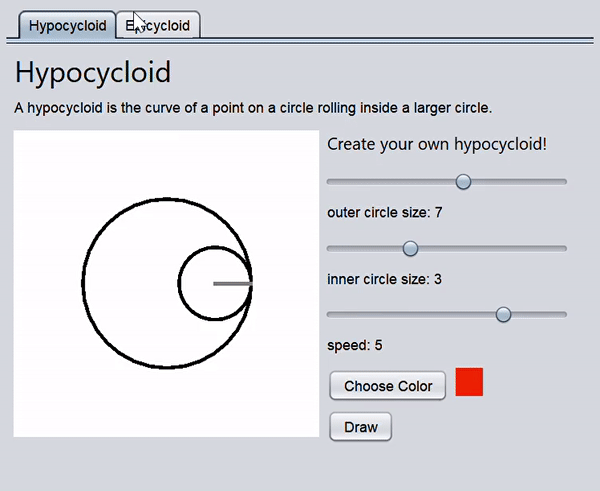
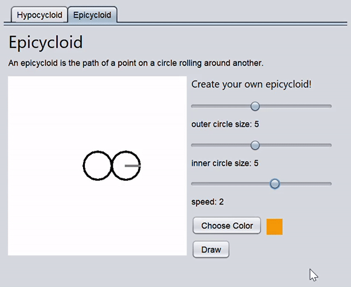

# Hypocycloid
An app for drawing hypocycloid and epicycloid curves using Javax Swing

Hypocycloid: the path of a fixed point on a circle rolling inside a larger one

Epicycloid: the path of a fixed point on a circle rolling around another
